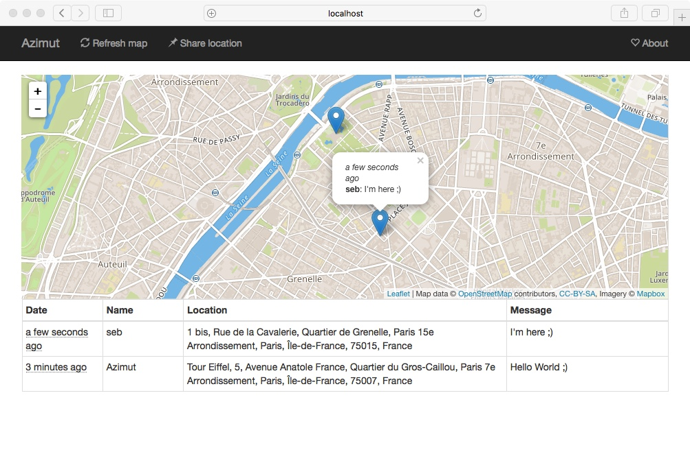
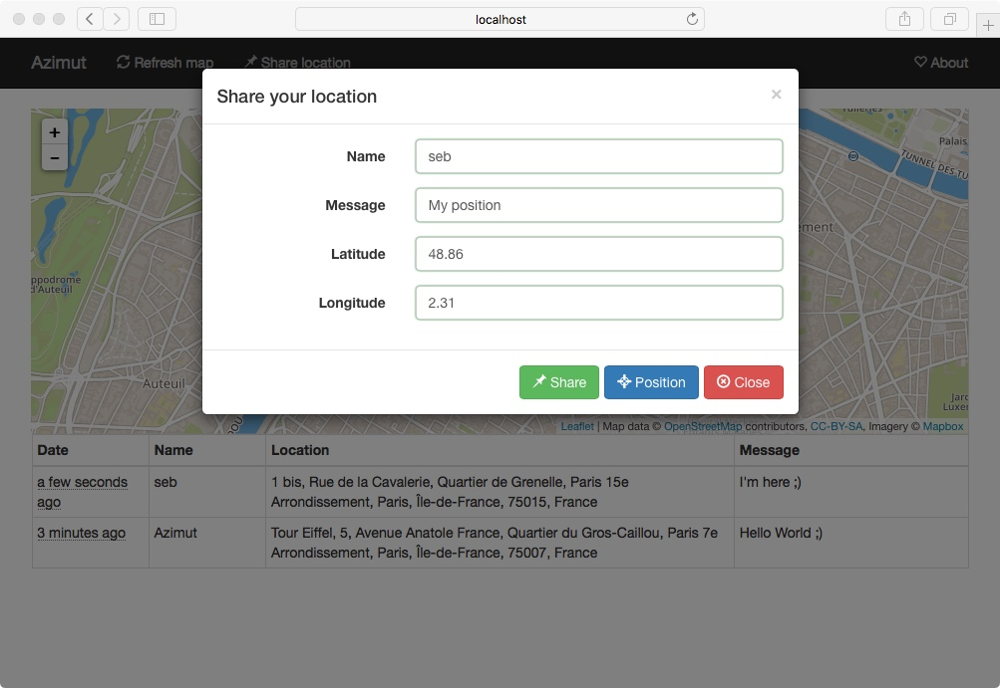

[](https://travis-ci.org/essembeh/azimut)


# Presentation

Azimut is a **self-hostable location sharing application**.

Sharing your location with your friends (or whoever your want) is a great feature that many social networks have, but geolocation is a very sensitive information.

The main goal of *Azimut* if to provide a geolocation service while **keeping control of your data**.

It is *free* (as free beer) and open-source so you can modify it as you want.


## Features

- Beatiful maps thanks to [Leaflet project](http://leafletjs.com/) which use [OpenStreetMap](http://openstreetmap.org) maps.
- Latitude and longitude are resolved to display place name using [Nominatim](https://nominatim.openstreetmap.org/).
- Easy to install: it is developed in Java and has a built-in web server. It also doesn't require any database.
- *You control your data!* You can choose to store a limited amount of event and to automatically delete them after a period.
- REST API to share position or to list and filter them.
- You can share your location using the website thanks to geolocation HTML5 API implemented by modern web browsers.
- Compatible with [Traccar clients](https://www.traccar.org/client/) so you automatically share your position using your smartphone.

## Keep It Simple

Azimut is developed to be lightweight and simple, it does one thing and tries to do it well.
It may be seen like an ultra light [Traccar](https://www.traccar.org) alternative.

Here are some feature that probably will never be implemented
- Authentication: There is no account to see the map and positions, if you want to restrict access, you can use *nginx/apache and authentication*
- Device management: By default everybody can share his location giving an *ID*. All you can do is restrict using a *mapping file* to restrict the IDs which can share their locations.


# Try it!

First you need Java 8
```shell
$ sudo apt-get install openjdk-8-jdk  maven
```

Clone and build the project
```shell
$ git clone https://github.com/essembeh/azimut
$ cd azimut
$ mvn clean install
```

Run the all-in-one jar
```shell
$ java -jar azimut-server/target/azimut-server-*-SNAPSHOT-jar-with-dependencies.jar
```

Then go to [http://localhost:8080](http://localhost:8080)


# Screenshots




